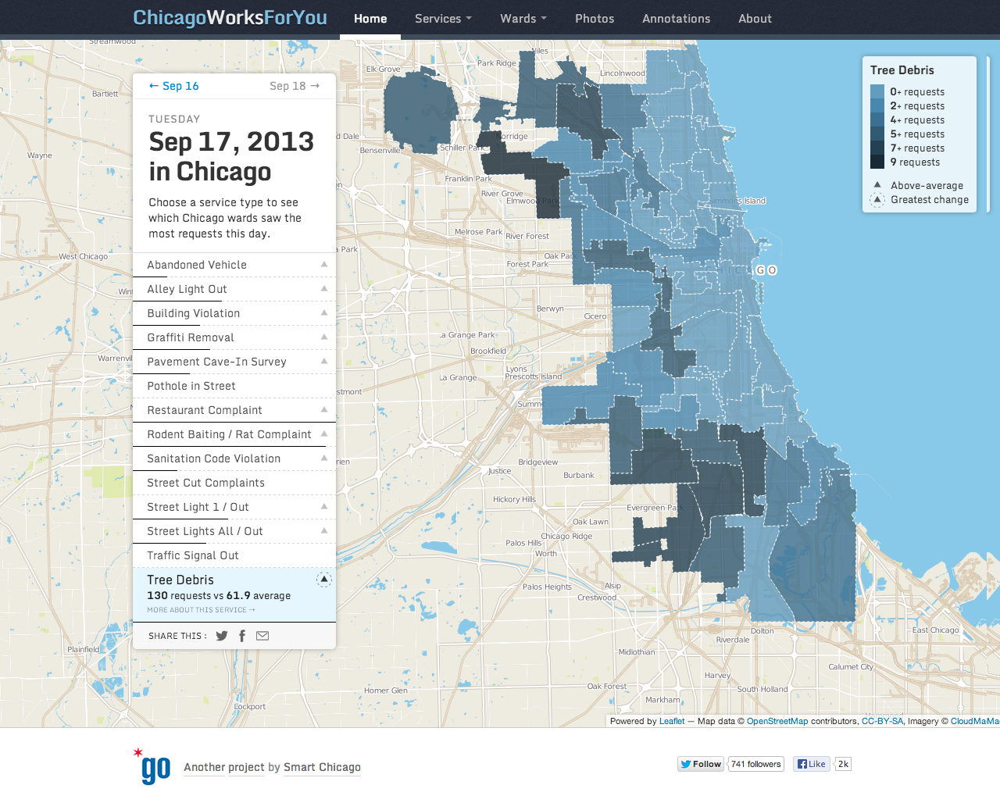

Chicago Works For You
=====================

[http://www.chicagoworksforyou.com](http://www.chicagoworksforyou.com)

Technical
---------

The CWFY website ([`frontend/`](frontend/)) runs on Jekyll and Compass. There is a backend API ([`api/`](api/)) written in Go.

See [API.md](doc/API.md) for details on how to use the backend API. See [FRONTEND.md](doc/FRONTEND.md) for information on the public-facing website.

Data
----

The service request data for Chicago Works For You comes from the [City of Chicago Open311 API](http://dev.cityofchicago.org/docs/api).

Snapshots of the CWFY database, in PostgreSQL pg_dump format, are available at: [http://cwfy-database-backups.s3.amazonaws.com/production.dump](http://cwfy-database-backups.s3.amazonaws.com/production.dump).

The database schema is available at [db/schema.sql](db/schema.sql).

Contributing
------------

We welcome contributions to the application. A few guidelines:

 * Fork this repository
 * Create a [topic branch](http://git-scm.com/book/en/Git-Branching-Branching-Workflows#Topic-Branches)
 * Open a pull request with a concise description of the change. Bonus points for a screenshot.

License
-------

The application code is released under the [MIT License](LICENSE.md). Editorial content is released under the Creative Commons [Attribution 3.0 Unported (CC BY 3.0)](http://creativecommons.org/licenses/by/3.0/deed.en_US) license. Content from other authors (e.g. photos on service types pages) are used according to their licenses.